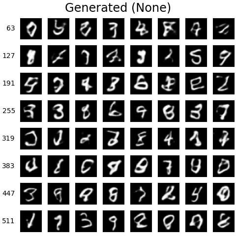
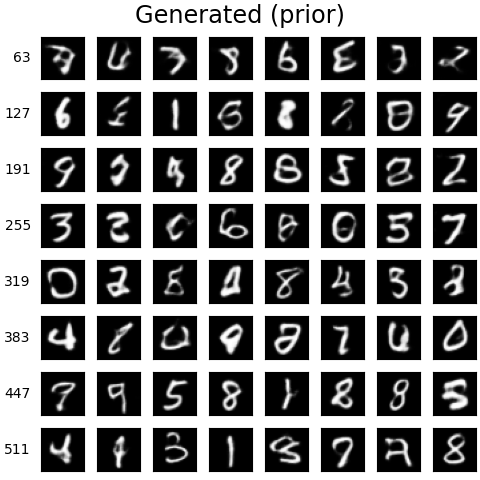

# VAE with Flow Prior/Posterior

## VAE

```
X --encoder--> Z --decoder--> X'
               ^
               |
            epsilon (Standard Gaussian)
```

Sampling result (row label signals epoch number):

](results/png/gen_None.png)

## VAE with Flow Prior

```
X --encoder--> Z --decoder--> X'
               ^
               |
             flow
               |
            epsilon (Standard Gaussian)
```

Sampling result (row label signals epoch number):

](results/png/gen_prior.png)


## VAE with Flow Posterior

```
X --encoder--> Z --flow--> Z_k --decoder--> X'
                            ^
                            |
                         epsilon (Standard Gaussian)
```

Sampling result (row label signals epoch number):

](results/png/gen_posterior.png)
